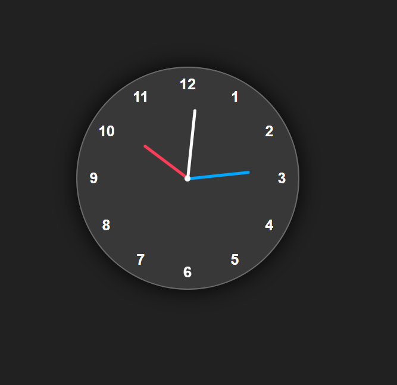

# Analog Clock

A simple **Analog Clock** built using **HTML, CSS, and JavaScript**.
This project shows the current time with moving **hour, minute, and second hands**.

## Features
- Live working analog clock
- Built with only HTML, CSS & JavaScript
- Minimal and clean design

## Screenshot

## Live Demo
[Click here to view](https://developertamanna.github.io/analog-clock/)
